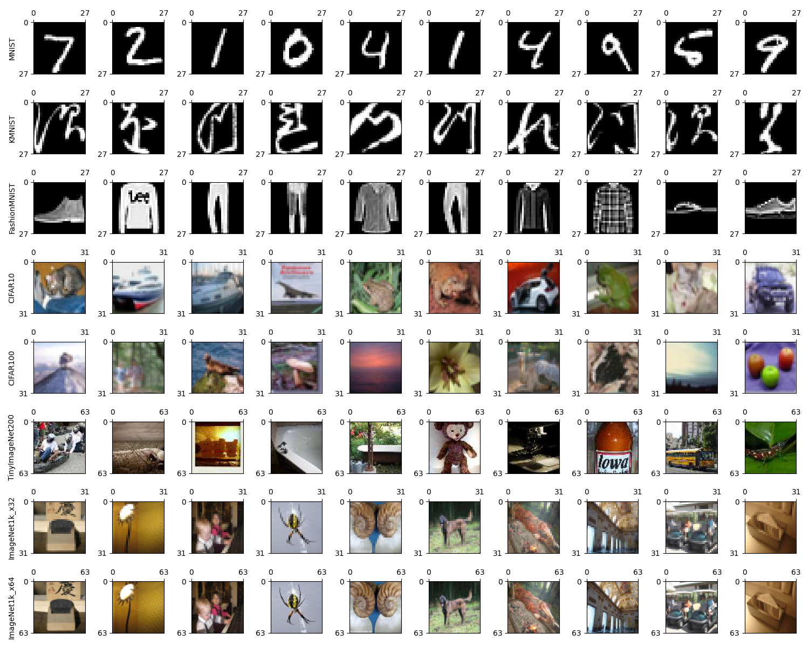

# Built-in Datasets

## Preview

```
python scripts/preview.py
```


## k-NN Baseline Results

```
python scripts/run_knn.py
```

| Dataset         | 1-NN  | 2-NN  | 3-NN  | 4-NN  | 5-NN  |
| :-:             | :-:   | :-:   | :-:   | :-:   | :-:   |
| MNIST           | 96.91 | 96.91 | 97.17 | 97.14 | 96.91 |
| KMNIST          | 92.25 | 92.25 | 91.91 | 92.10 | 91.72 |
| FashionMNIST    | 84.97 | 84.97 | 85.61 | 85.97 | 85.77 |
| CIFAR10         | 35.39 | 35.39 | 35.69 | 35.42 | 35.67 |
| CIFAR100        | 17.55 | 17.55 | 17.53 | 17.58 | 17.42 |

## Download

### [MNIST](http://yann.lecun.com/exdb/mnist/)
```
wget https://www.dropbox.com/s/y18xf25kyna3u50/MNIST.tar.gz
tar -xvzf MNIST.tar.gz
```

### [KMNIST](https://github.com/rois-codh/kmnist)
```
wget https://www.dropbox.com/s/crdkhcfs9jfs3m3/KMNIST.tar.gz
tar -xvzf KMNIST.tar.gz
```

### [FashionMNIST](https://github.com/zalandoresearch/fashion-mnist)
```
wget https://www.dropbox.com/s/nlbxznph3mc3se2/FashionMNIST.tar.gz
tar -xvzf FashionMNIST.tar.gz
```

### [CIFAR10](https://www.cs.toronto.edu/~kriz/cifar.html)
```
wget https://www.dropbox.com/s/3w9srxvvos3xaj3/CIFAR10.tar.gz
tar -xvzf CIFAR10.tar.gz
```

### [CIFAR100](https://www.cs.toronto.edu/~kriz/cifar.html)
```
wget https://www.dropbox.com/s/wra2ol0rzq4twjh/CIFAR100.tar.gz
tar -xvzf CIFAR100.tar.gz
```

### TinyImageNet200
```
wget --load-cookies ~/cookies.txt "https://docs.google.com/uc?export=download&confirm=$(wget --quiet --save-cookies ~/cookies.txt --keep-session-cookies --no-check-certificate 'https://docs.google.com/uc?export=download&id=1rRlczcdt8XHP62hb155s30zMqHuwglep' -O- | sed -rn 's/.*confirm=([0-9A-Za-z_]+).*/\1\n/p')&id=1rRlczcdt8XHP62hb155s30zMqHuwglep" -O TinyImageNet200.tar.gz && rm -rf ~/cookies.txt
tar -xvzf TinyImageNet200.tar.gz
```

### ImageNet1k_x32
```
(TBD)
```

### ImageNet1k_x64
```
(TBD)
```
